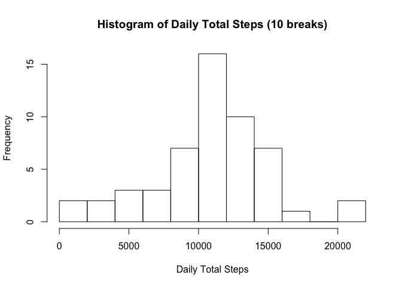
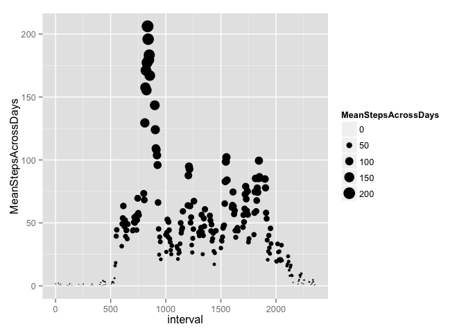
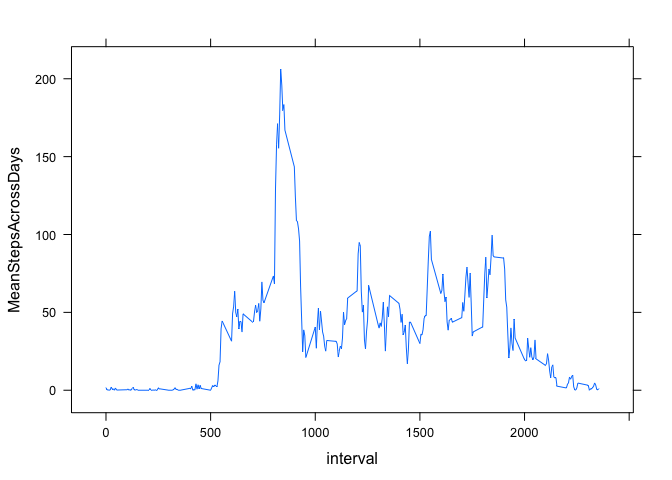
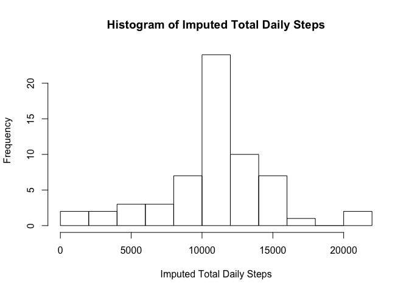
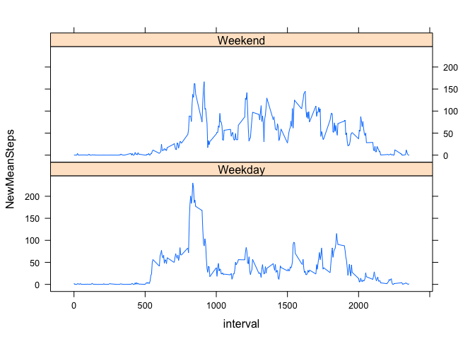

# Reproducible Research - Assignment 1
Cesar Espitia  
June 11, 2015  

The following is Assignment 1 that analyzes data from a fitness tracker.  

##Loading and preprocessing the data

I am using the dplyr package to manipulate data for use in this assignment.


```r
library(dplyr)
```

```
## 
## Attaching package: 'dplyr'
## 
## The following object is masked from 'package:stats':
## 
##     filter
## 
## The following objects are masked from 'package:base':
## 
##     intersect, setdiff, setequal, union
```

```r
activity <- read.csv("activity.csv", header=T)
data <- tbl_df(activity)
datacomplete <- na.omit(data)
```

##What is the mean total number of steps taken per day?

##### 1. The data is grouped by date and daily steps are calculated prior to creating a histogram and calculating the mean/median.


```r
byday <- group_by(datacomplete, date)
stepsbyday <- summarise(byday, DailySteps = sum(steps), MeanSteps = mean(steps), MedianSteps = median(steps))

#For my histogram I chose 10 breaks as it game me a good visual of how data is centered

hist(stepsbyday$DailySteps, breaks = 10, main="Histogram of Daily Total Steps (10 breaks)", xlab="Daily Total Steps")
```

 

```r
# The following is the mean and median of the data from the data frame byday

summarise(byday, mean = mean(steps), median = median(steps))
```

```
## Source: local data frame [53 x 3]
## 
##          date     mean median
## 1  2012-10-02  0.43750      0
## 2  2012-10-03 39.41667      0
## 3  2012-10-04 42.06944      0
## 4  2012-10-05 46.15972      0
## 5  2012-10-06 53.54167      0
## 6  2012-10-07 38.24653      0
## 7  2012-10-09 44.48264      0
## 8  2012-10-10 34.37500      0
## 9  2012-10-11 35.77778      0
## 10 2012-10-12 60.35417      0
## ..        ...      ...    ...
```

##What is the average daily activity pattern?

##### 1. The following plot illustrates the 5-min Interval along the x-axis and the Average Daily Steps across all days along the y-axis.


```r
library(lattice)
library(ggplot2)
#group data first by interval
by5min <- group_by(datacomplete, interval)

#create new columns that calculate Total Steps, Mean, and Median Across all days by Interval
stepsby5min <- summarise(by5min, TotalStepsAcrossDays = sum(steps), MeanStepsAcrossDays = mean(steps), MedianStepsAcrossDays = median(steps))

#Two plots, one using ggplot because I can see the weight of the data and one using xyplot to plot a Time-Series plot
ggplot(stepsby5min, aes(interval, MeanStepsAcrossDays)) + geom_point(aes(size = MeanStepsAcrossDays)) + scale_size_area()
```

 

```r
xyplot(MeanStepsAcrossDays ~ interval, stepsby5min, type="l")
```

 

##### 2. The 5-minute interval with the max average across all days is interval = 835.

```r
#filtered my data by max value in Mean Steps
filter(stepsby5min, MeanStepsAcrossDays == max(MeanStepsAcrossDays))
```

```
## Source: local data frame [1 x 4]
## 
##   interval TotalStepsAcrossDays MeanStepsAcrossDays MedianStepsAcrossDays
## 1      835                10927            206.1698                    19
```


##Imputing missing values

The following is determining the missing data and choosing a method to impute them.

##### 1.  How many NA in data set?

```r
sum(is.na(data$steps))
```

```
## [1] 2304
```

##### 2 and 3.  What is your strategy to impute the missing NA data and fill in the data in a newdataset?

I will be using the mean value at each time interval to impute missing data.


```r
#Left Join allows me to take the original grouped data and join the imputed data to manipulate
dataimpute <- left_join(data, stepsby5min)
```

```
## Joining by: "interval"
```

```r
dataimpute2 <- dataimpute %>% mutate(steps=ifelse(is.na(steps), MeanStepsAcrossDays, steps))
dataimpute2 <- select(dataimpute2, steps:interval)
```

##### 4.  The following is the histogram for the new data set.

It plots the total number of steps taken per day.


```r
imputedbyday <- group_by(dataimpute2, date)
imputedstepsbyday <- summarise(imputedbyday, ImpDailySteps = sum(steps), ImpMeanSteps = mean(steps), ImpMedianSteps = median(steps))
hist(imputedstepsbyday$ImpDailySteps, breaks = 10, main = "Histogram of Imputed Total Daily Steps", xlab="Imputed Total Daily Steps")
```

 

```r
#Calculating the mean and median of the new imputed data
summarise(imputedbyday, mean = mean(steps), median = median(steps))
```

```
## Source: local data frame [61 x 3]
## 
##          date     mean   median
## 1  2012-10-01 37.38260 34.11321
## 2  2012-10-02  0.43750  0.00000
## 3  2012-10-03 39.41667  0.00000
## 4  2012-10-04 42.06944  0.00000
## 5  2012-10-05 46.15972  0.00000
## 6  2012-10-06 53.54167  0.00000
## 7  2012-10-07 38.24653  0.00000
## 8  2012-10-08 37.38260 34.11321
## 9  2012-10-09 44.48264  0.00000
## 10 2012-10-10 34.37500  0.00000
## ..        ...      ...      ...
```

The following is the merging of the summaries for the original data and the imputed data using cbind.    I then visually comapred them.


```r
statscompare <- cbind(summary(imputedstepsbyday$ImpMeanSteps), summary(stepsbyday$MeanSteps), summary(imputedstepsbyday$ImpMedianSteps), summary(stepsbyday$MedianSteps))
colnames(statscompare) <- c("ImpMeanSteps", "OrigMeanSteps", "ImpMedianSteps", "OrigMedianSteps")
print(statscompare)
```

```
##         ImpMeanSteps OrigMeanSteps ImpMedianSteps OrigMedianSteps
## Min.          0.1424        0.1424          0.000               0
## 1st Qu.      34.0900       30.7000          0.000               0
## Median       37.3800       37.3800          0.000               0
## Mean         37.3800       37.3800          4.474               0
## 3rd Qu.      44.4800       46.1600          0.000               0
## Max.         73.5900       73.5900         34.110               0
```

As you can see from the above table, there are fluctuations in the 1st and 3rd Quartile of the Mean Daily Steps.  Similarly the Mean and Max of the Median Daily Steps was affected by the imputed data.  

## Are there differences in activity patterns between weekdays and weekends?

The following determines if the date is a weekday or weekend, and will be stored as a new factor.  The imputed data "dataimpute2" is being used for this section.

#####1. Create new data with Weekday and Weekend factors as a flag.


```r
library(lubridate)
DayFlagData <- mutate(dataimpute2, DayFlag = ifelse(wday(dataimpute2$date, label = TRUE) %in% c("Sat", "Sun"), "Weekend", "Weekday"))
```

##### 2. The following plot illustrates the 5-min Interval along the x-axis and the Average Daily Steps across all days along the y-axis now using Weekend and Weekday flags.


```r
library(lattice)
library(ggplot2)
GroupFlagData <- group_by(DayFlagData, interval, DayFlag)
GroupFlagData <- summarise(GroupFlagData, NewTotalSteps = sum(steps), NewMeanSteps = mean(steps))
xyplot(NewMeanSteps ~ interval | DayFlag, GroupFlagData, type="l", ncol = 1, layout = c(1,2))
```

 

#####There are differences in the Weekday and Weekend data from the fitness monitor.  During the weekdays there is a true peak of movement around the 8-9am time period.  This can be attributed to people working out or just arriving at their jobs and moving around a lot.  During the weekend the movement is more spreadout with less concentrations around a specific time-period.
